# Git

## 1.右键需要上传的项目（文件夹），进入git bash here，进入

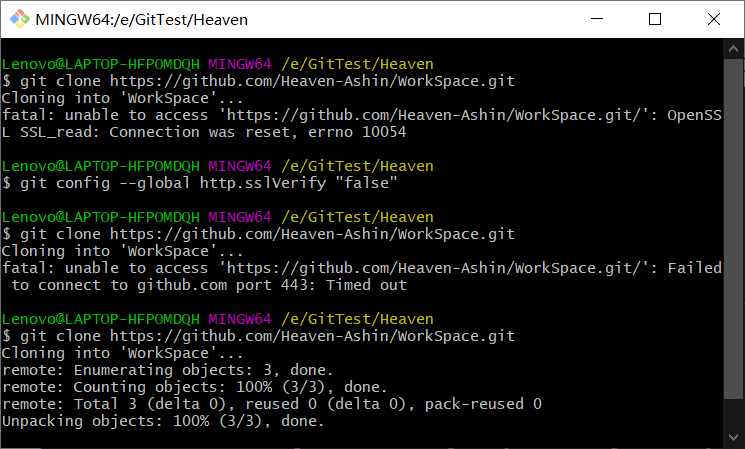

## 2.克隆远程仓库：

```
git clone https://……（远程仓库地址）
```

仓库地址：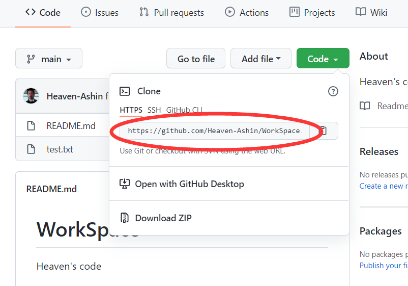

会经常遇到这个错误：

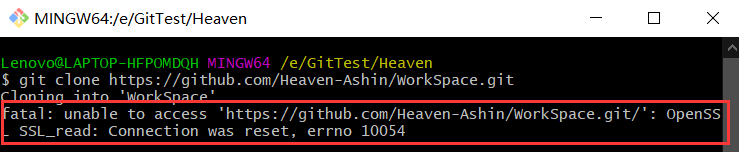

产生的原因：因为服务器的SSL证书没有经过第三方机构的签署，所以才报错（来自csdn）

解决办法：解除ssl验证后，再次git即可

```
git config --global http.sslVerify "false"
```

输入以上命令后再次clone即可，如果出现相同错误多试几次

## 3.克隆成功后：

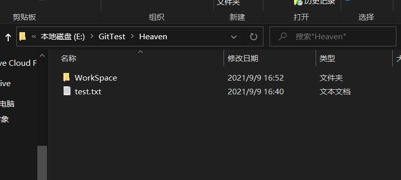

test.txt是我原来有的文件并且准备上传的，WorkSpace是克隆成功后多出来的文件夹，也是自己github上的项目名称

## 4.将需要上传的文件全部复制到WorkSpace里面，右键WorkSpace进入git bash here

## 5.依次输入如下命令：

```
git add .（注：别忘记后面的.，此操作是把Test文件夹下面的文件都添加进来）
```

```
git commit  -m  "提交信息"  （注：“提交信息”里面换成你需要，如“first commit”）
```

```
git push -u origin main   （注：此操作目的是把本地仓库push到github上面，此步骤需要你输入帐号和密码）
```

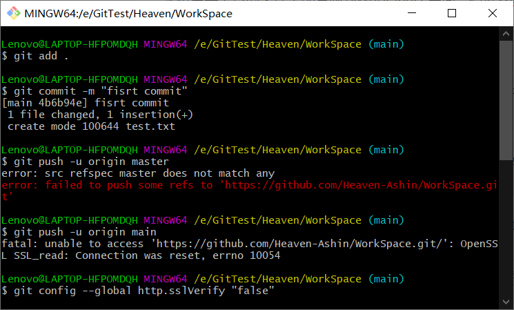

红色字体的错误应该是连接问题，我多试了两遍就成功了

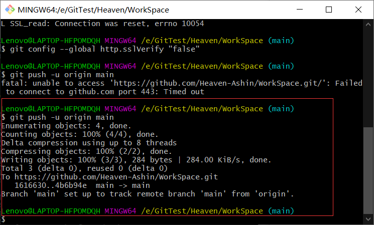

出现红框就push成功了

## 注意：重点

要打开权限，不然push不上

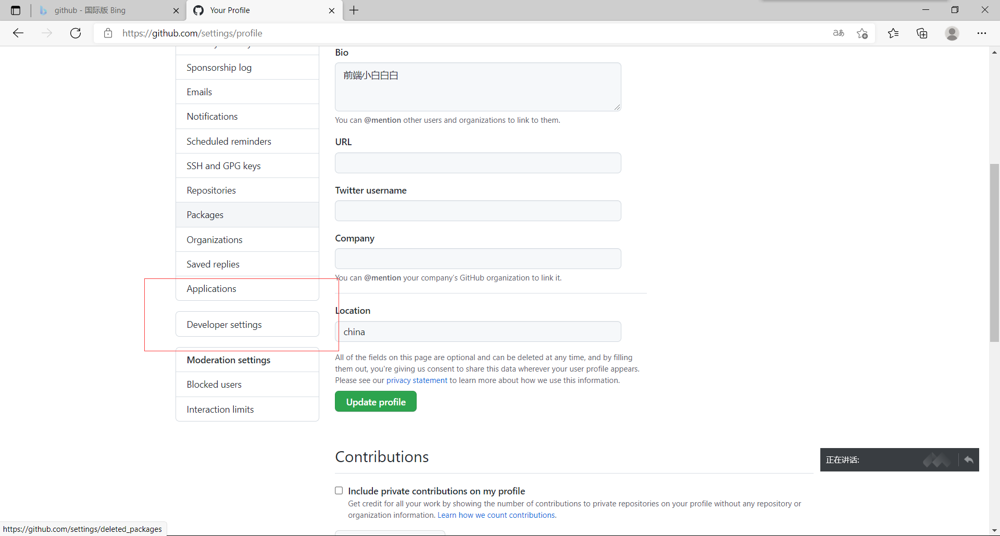

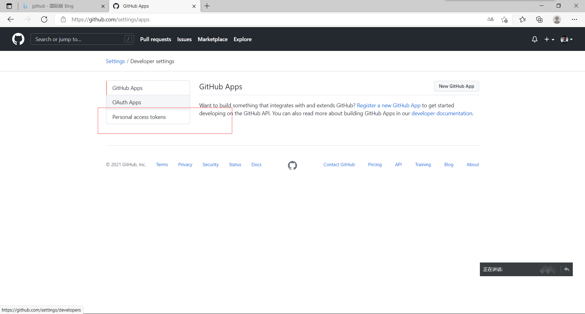

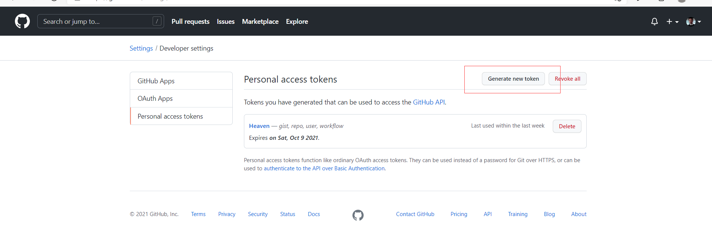

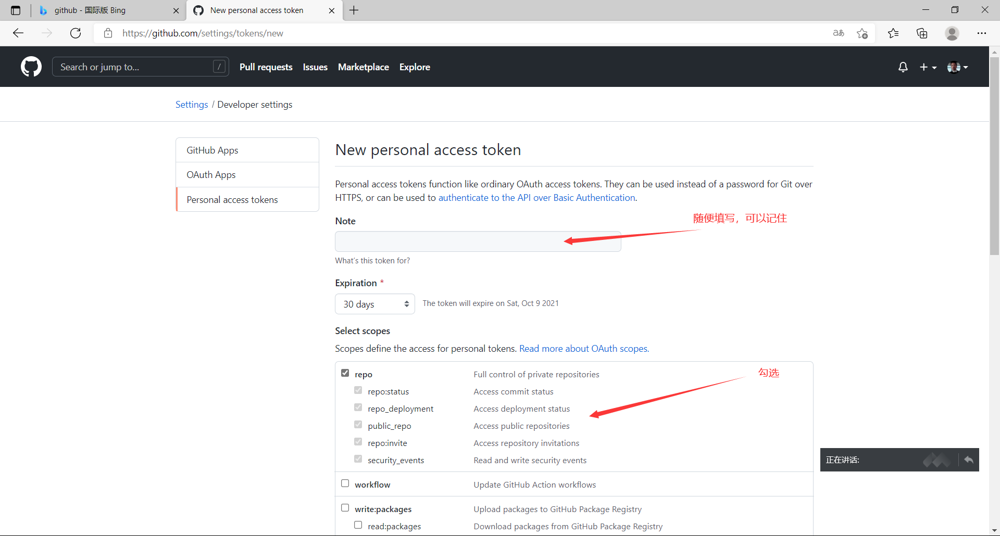

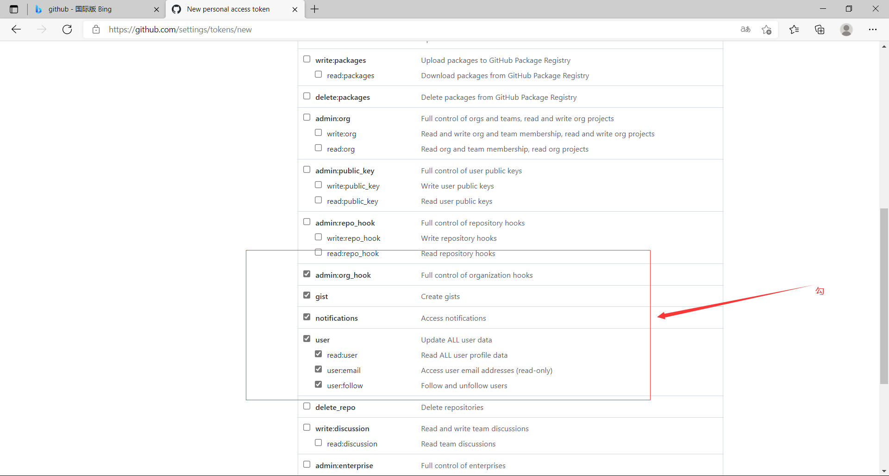

最后选择Generate token，会生成一个随机密码

在push的过程中如果弹出输入用户名和密码的框，输入刚刚填写的那个用户名（注意：不是github用户名）和上面的随机密码。

